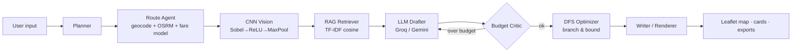

# VOYAGR Architecture
Static, zero-backend web app (GitHub Pages friendly). All AI calls go browser → provider using the user's own key.

## Modules (`assets/js`, loaded in this order)
| File | Responsibility |
|---|---|
| config.js | App metadata, currency table (`FX`), fare model (`MODES`) |
| utils.js | `$`, `esc`, `sleep`, `file`, link helpers |
| background.js / pipeline-ui.js | Particle background, agent chips + live log |
| rag.js | Knowledge base + TF-IDF cosine retrieval |
| cnn.js | In-browser conv/pool scene classifier |
| dfs.js | Haversine + branch-and-bound shortest visiting order |
| ai.js | Provider gateway, **model auto-discovery**, JSON schema, retries |
| travel.js | Geolocation, geocoding, OSRM road route, `planModes`, journey card |
| maps.js | Leaflet map (journey + day layers), Nominatim, Wikipedia guide |
| render.js / features.js | Trip rendering; weather, checklist, chat, .ics, share, expense tracker |
| storage.js / demo-data.js | Saved trips, bundled demo |
| agent.js | Orchestrator `run()` — the agent pipeline |
| ui.js | Boot sequence, key manager, theme, voice input |

## Money model
`grand total = on-ground estimate (LLM) + round-trip travel (fare model)`. The LLM is told the **on-ground budget** = budget − travel, so the Budget Critic loop works on the correct number.
Fare model (INR, estimates): flight `2400 + 4.2/km`, train `120 + 1.55/km`, bus `80 + 1.8/km`, cab `13/km/vehicle` (4 seats). Auto-select = cheapest option ≤ 18 h.

## External services (all free, no key): OSRM, Nominatim/OSM tiles, Open-Meteo, Wikipedia. Keys (Groq/Gemini) stay in `localStorage`.
## Limits: fares are estimates; Nominatim/OSRM public servers are rate-limited; CNN is a fixed-kernel heuristic, not a trained network.
